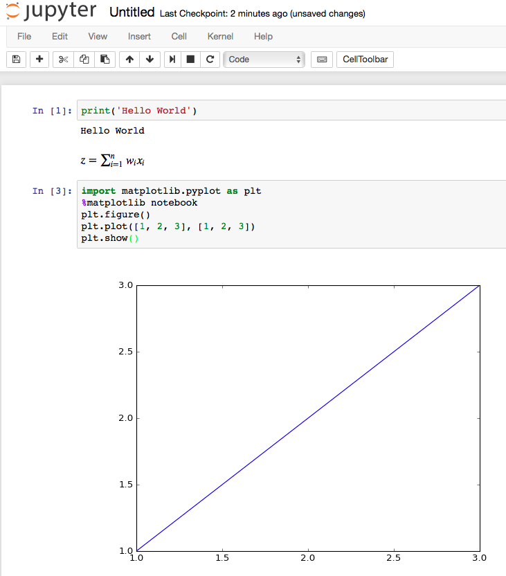

##  1장: 컴퓨터는 데이터에서 배운다

---

**1장에는 코드 예제가 없습니다.**

---

## 파이썬 패키지 설치

파이썬은 세 개의 주요 운영 체제인 마이크로소프트 윈도(Microsoft Windows), macOS, 리눅스
(Linux)에서 사용할 수 있습니다. 파이썬 공식 웹 사이트(https://www.python.org)에서 문서와
설치 파일을 내려받을 수 있습니다

책은 파이썬 3.7.2 버전과 그 이상에 맞추어져 있습니다. 현재 파이썬 3의 최신 버전을 사용하
는 것이 좋습니다.
일부 코드는 파이썬 2.7과 호환될 수 있지만 파이썬 2.7의 공식 지원이 2019년 말에 끝났기 때문에 상당수의 오픈 소스 라이브러리는 이미 파이썬 2.7에 대한 지원을 중단했습니다(https://python3statement.org/). 따라서 파이썬 3.7 또는 그 이상을 사용하는 것이 매우 권장됩니다.

**노트**

다음 명령으로 현재 파이썬 버전을 확인할 수 있습니다.

    $ python -V

예를 들면 다음과 같이 출력됩니다.

    Python 3.7.1 :: Continuum Analytics, Inc.

#### pip

책에서 사용할 패키지는 pip 설치 프로그램으로 설치할 수 있습니다. 이 프로그램은 파이썬 3.3
버전부터 파이썬 표준 라이브러리에 포함되었습니다. 자세한 pip 설명은 온라인 문서(https://
docs.python.org/3/installing/index.html)를 참고하세요.

파이썬을 설치하고 난 후 터미널(Terminal)에서 pip 명령으로 필요한 파이썬 패키지를 설치할 수
있습니다:

    pip install SomePackage

(`SomePackage`는 numpy, pandas, matplotlib, scikit-learn 등이 될 수 있습니다)

설치한 패키지를 업데이트할 때는 `--upgrade` 옵션을 사용합니다:

    pip install SomePackage --upgrade

#### 아나콘다

과학 컴퓨팅을 위해서는 컨티넘 애널리틱스(Continuum Analytics)의 아나콘다(Anaconda) 파이썬 배포판을 권장합니다. 아나콘다는 상업적 목
적을 포함하여 무료로 사용할 수 있고 기업이 사용하기 충분한 수준의 파이썬 배포판입니다. 데이
터 과학, 수학, 공학용 파이썬 필수 패키지들을 모두 포함하고 있으며 주요 운영 체제를 모두 지원
합니다. 아나콘다 설치 파일은 https://www.anaconda.com/download/에서 내려받을 수 있
습니다. 간단한 아나콘다 안내는 온라인 문서(https://docs.anaconda.com/anaconda/userguide/
getting-started/)를 참고하세요.

아나콘다를 설치한 후 다음 명령으로 필요한 파이썬 패키지를 설치할 수 있습니다:

    conda install SomePackage

설치한 패키지를 업데이트할 때는 다음 명령을 사용합니다:

    conda update SomePackage

책 전반에 걸쳐 데이터를 저장하고 조작하는 데 넘파이 다차원 배열을 주로 사용합니다. 이따금
판다스(Pandas)도 사용합니다. 판다스는 넘파이 위에 구축된 라이브러리고 테이블 형태의 데이터
를 아주 쉽게 다룰 수 있는 고수준 도구를 제공합니다. 종종 정량적인 데이터를 시각화하면 
이해하는 데 매우 도움이 됩니다. 이를 위해 많은 옵션을 제공하는 맷플롯립(Matplotlib) 라이
브러리를 사용하겠습니다.

#### 핵심 패키지

책에서 사용하는 주요 파이썬 패키지 버전은 다음과 같습니다. 여러분 컴퓨터에 설치된 패키지와
버전이 동일하거나 더 높은지 확인하세요. 예제 코드를 정상적으로 실행하려면 버전을 맞추는 것
이 좋습니다:

- [NumPy](http://www.numpy.org) >= 1.18.5
- [SciPy](http://www.scipy.org) >= 1.4.1
- [scikit-learn](http://scikit-learn.org/stable/) >= 0.23.2
- [matplotlib](http://matplotlib.org) >= 3.1.1
- [pandas](http://pandas.pydata.org) >= 1.0.4
- [TensorFlow](https://www.tensorflow.org) >= 2.3.0

## Python/Jupyter Notebook

Some readers were wondering about the `.ipynb` of the code files -- these files are IPython notebooks. I chose IPython notebooks over plain Python `.py` scripts, because I think that they are just great for data analysis projects! IPython notebooks allow us to have everything in one place: Our code, the results from executing the code, plots of our data, and documentation that supports the handy Markdown and powerful LaTeX syntax!

**Side Note:**  "IPython Notebook" recently became the "[Jupyter Notebook](<http://jupyter.org>)"; Jupyter is an umbrella project that aims to support other languages in addition to Python including Julia, R, and many more. Don't worry, though, for a Python user, there's only a difference in terminology (we say "Jupyter Notebook" now instead of "IPython Notebook").

The Jupyter notebook can be installed as usually via pip.

    $ pip install jupyter notebook

Alternatively, we can use the Conda installer if we have Anaconda or Miniconda installed:

    $ conda install jupyter notebook

To open a Jupyter notebook, we `cd` to the directory that contains your code examples, e.g,.

    $ cd ~/code/python-machine-learning-book

and launch `jupyter notebook` by executing

    $ jupyter notebook

Jupyter will start in our default browser (typically running at [http://localhost:8888/](http://localhost:8888/)). Now, we can simply select the notebook you wish to open from the Jupyter menu.

For more information about the Jupyter notebook, I recommend the [Jupyter Beginner Guide](http://jupyter-notebook-beginner-guide.readthedocs.org/en/latest/what_is_jupyter.html) and [Jupyter Notebook Basics](https://jupyter-notebook.readthedocs.io/en/stable/examples/Notebook/Notebook%20Basics.html).

## Jupyter Lab

An alternative to Jupyter Notebook, called Jupyter Lab, was released in 2018. It operates with the same `.ipynb` file types but offers some extra features in the browser interface. Whether you use Jupyter Notebook or Jupyter Lab is a matter of preference, but

Jupyter Lab can be installed via 

    $ conda install -c conda-forge jupyterlab
    
and similar to starting Jupyter Notebooks, you can run the command 

    $ jupyter lab
    
in your command line terminal to launch a Jupyter Lab session in your browser. For more information about the Jupyter Lab project, please visit the official documentation at https://jupyterlab.readthedocs.io/en/stable/,
